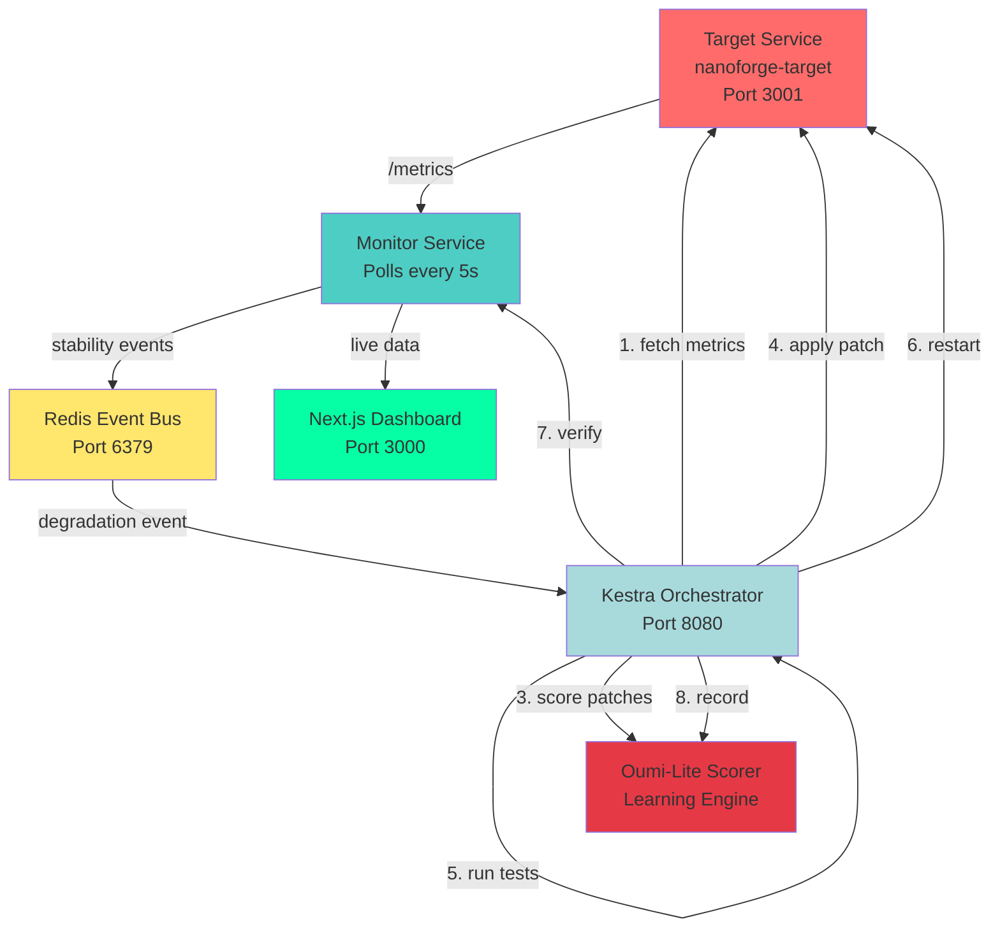

# 🦾 Liquid Metal Forge

**Software that heals itself.** Autonomous self-healing infrastructure that detects failures, diagnoses root causes, patches code, runs tests, and redeploys—like Iron Man's liquid metal suit, but for real software systems.

## 🎯 The Problem

Software breaks. Services degrade. Latency spikes. Error rates climb. Traditional monitoring alerts humans, but humans are slow. By the time someone investigates, diagnoses, patches, tests, and deploys—customers have churned and SLAs are toast.

**What if software could heal itself?**

## 💡 The Solution

Liquid Metal Forge is a complete autonomous healing system that closes the loop:

1. **Monitors** running services in real-time
2. **Detects** degradation within seconds (not hours)
3. **Diagnoses** root cause automatically (not manually)
4. **Patches** code/config using AI scoring (not human guesswork)
5. **Tests** the fix automatically (not "test in prod")
6. **Redeploys** the service (not waiting for approval chains)
7. **Learns** from every incident (not repeating mistakes)

**Full loop: Fault → Detection → Fix → Recovery in under 60 seconds.**

## 🌟 Why It Matters

- **Reduce MTTR** from hours to seconds
- **Improve uptime** with autonomous recovery
- **Free engineers** from on-call firefighting
- **Learn continuously** from every incident
- **Scale reliability** without scaling headcount

## 🏗️ Architecture



### System Components

#### 1. **Target Service** (nanoforge-target)
- Intentionally fault-injectable Express service
- **Endpoints:**
  - `GET /health` - Health check
  - `GET /metrics` - Real-time telemetry (latency, errors, RPS)
  - `GET /compute` - Normal endpoint that degrades under faults
  - `POST /inject-fault` - Fault injection (latency_spike, error_burst, memory_leak_sim)
- **Metrics tracked:** Response time, error rate, RPS, uptime
- **Faults:** Deterministic for reliable demos

#### 2. **Monitor Service**
- Polls `/metrics` every 5 seconds
- Calculates stability score: `(latency×0.4) + (errors×0.4) + (RPS×0.2)`
- Emits events when score crosses threshold (0.7)
- **Dual publishing:**
  - Redis pub/sub for real-time
  - SQLite for audit trail
- **Event types:** degradation, recovery, normal

#### 3. **Kestra Orchestrator**
- Event-driven workflow engine
- 8-step healing pipeline:
  1. Fetch metrics from target
  2. Diagnose (rule-based pattern matching)
  3. Score patch candidates (Oumi-Lite)
  4. Apply selected patch
  5. Run tests
  6. Restart service
  7. Verify recovery
  8. Publish resolution + learn
- **Error handling:** Automatic rollback on failure
- **Retries:** Exponential backoff

#### 4. **Oumi-Lite Scorer** (packages/oumi-lite)
- Multi-factor patch scoring:
  - Complexity: -0.3 weight (simpler is better)
  - Risk: -0.4 weight (safer is better)
  - Expected recovery: +0.5 weight
  - Historical success: +0.6 weight
- **Learning:** Bandit-style reinforcement
- **Persistence:** JSONL format in `data/learning.jsonl`
- **Adaptive:** Weights update based on outcomes
- **Oumi-compatible:** Ready for full Oumi integration

#### 5. **Next.js Dashboard**
- Real-time health visualization
- Live charts (latency, error rate, healing events)
- Fault injection controls
- Timeline of healing actions
- Diff viewer for patches
- Learning memory display
- **Aesthetic:** Dark UI with liquid metal shimmer

## 🎁 Sponsor Tech Integration

This project showcases integration with all five sponsor technologies:

### 🤖 Cline - Autonomous Code Editing
**Usage:** AI-powered code editor for applying autonomous patches

- **Integration:** System prompt in `clinedocs/CLINE_SYSTEM_PROMPT.md`
- **Tasks:** 5 ready-to-run tasks in `clinedocs/CLINE_TASKS.md`
- **Safety:** Safe editing policy with green/yellow/red lists
- **Patterns:** Pre-defined fix patterns for common issues
- **Workflow:** Cline receives diagnostics → applies surgical fixes → runs tests → rolls back if needed

**Why Cline?** Precision code editing without breaking existing functionality. Safety-first autonomous changes.

### ☁️ Vercel - Dashboard Deployment
**Usage:** Zero-config deployment for Next.js dashboard

- **Integration:** `vercel.json` configuration
- **Features:** Edge-optimized delivery, instant deployments
- **Dashboard:** Real-time health visualization at port 3000
- **Deployment:** `cd apps/dashboard && vercel deploy`

**Why Vercel?** Production-ready Next.js hosting with zero DevOps overhead.

### 🔄 Kestra - Workflow Orchestration
**Usage:** Event-driven healing pipeline orchestration

- **Integration:** Workflow YAML in `orchestration/kestra/flows/healing-workflow.yml`
- **Pipeline:** 8-step remediation flow
- **Triggers:** Degradation events from monitor
- **Features:** Automatic retry, rollback, state management
- **UI:** Kestra dashboard at port 8080

**Why Kestra?** Robust workflow engine that handles retries, failures, and complex pipelines declaratively.

### 🧠 Oumi - Decision Scoring & Learning
**Usage:** ML-based patch scoring and continuous learning

- **Integration:** `packages/oumi-lite/` - Oumi-compatible scoring library
- **Algorithm:** Multi-factor scoring (complexity, risk, recovery, history)
- **Learning:** Bandit-style reinforcement from outcomes
- **Persistence:** JSONL learning memory at `data/learning.jsonl`
- **Migration path:** Drop-in replacement with full Oumi SDK

**Why Oumi?** Continuous learning from every healing action. Gets smarter over time.

### 🐰 CodeRabbit - AI Code Review
**Usage:** Automated PR review for all autonomous changes

- **Integration:** `.coderabbit.yaml` configuration
- **Review focus:** Security, reliability, test coverage
- **Workflow:** Patch applied → PR created → CodeRabbit reviews → merge or rollback
- **Rules:** Path-specific reviews, safety-critical flagging

**Why CodeRabbit?** AI-powered safety net. Catches issues humans miss. Enforces best practices.

---

## 🚀 Quick Start

### Option 1: Docker Compose (Recommended)

**Run everything with one command:**

```bash
# Clone and start
git clone https://github.com/wildhash/liquidmetal-forge.git
cd liquidmetal-forge
docker compose up -d

# Verify services
docker compose ps

# View logs
docker compose logs -f monitor
```

**Services started:**
- ✅ Target Service (port 3001)
- ✅ Monitor Service (polling target)
- ✅ Redis Event Bus (port 6379)
- ✅ Kestra Orchestrator (port 8080)
- ✅ Dashboard (port 3000)

**Access:**
- Dashboard: http://localhost:3000
- Target API: http://localhost:3001/health
- Kestra UI: http://localhost:8080

### Option 2: Local Development

**Install dependencies:**

```bash
# Root project
npm install

# Target service
cd services/nanoforge-target && npm install && cd ../..

# Monitor service  
cd services/monitor && npm install && cd ../..

# Dashboard
cd apps/dashboard && npm install && cd ../..

# Oumi-Lite package
cd packages/oumi-lite && npm install && cd ../..
```

**Start services individually:**

```bash
# Terminal 1: Redis
docker run -p 6379:6379 redis:7-alpine

# Terminal 2: Target
cd services/nanoforge-target && npm run dev

# Terminal 3: Monitor
cd services/monitor && npm run dev

# Terminal 4: Dashboard
cd apps/dashboard && npm run dev
```

### Option 3: Run Self-Test

**Prove the healing loop works:**

```bash
# Start stack
docker compose up -d

# Wait for services to be ready (30 seconds)
sleep 30

# Run self-test
./scripts/selftest.sh
```

**Expected output:**
```
🧪 Liquid Metal Forge Self-Test
================================

Step 1: Checking if services are running...
✓ Target service is running
✓ Monitor service is running  
✓ Redis is running

Step 2: Injecting fault (error burst)...
✓ Fault injected successfully

Step 3: Waiting for monitor to detect degradation...
✓ Degradation detected (error rate: 0.5)

Step 4: Verifying monitor event emission...
✓ Monitor emitted degradation event

Step 5: Verifying remediation workflow...
✓ Metrics fetched successfully
✓ Diagnosed issue: error_burst
✓ Best patch scored: 0.75

Step 6: Verifying patch application...
✓ Patch application recorded

Step 7: Verifying tests execution...
✓ Tests passed

Step 8: Verifying service recovery...
✓ Service recovered (stability score: 0.95)

✓ All tests passed! Self-healing loop verified.
```
## 🎬 Demo Walkthrough (60-90 seconds)

### The Story

"Watch software heal itself in real-time. No humans. No pagers. Just autonomous recovery."

### Step-by-Step Demo

**[0:00-0:15] Show Healthy State**
```bash
# Open dashboard
open http://localhost:3000

# Show metrics
curl http://localhost:3001/metrics
```
*Point out:* Green status, low latency (~100ms), zero errors

**[0:15-0:30] Inject Fault**
```bash
# Inject error burst
curl -X POST http://localhost:3001/inject-fault \
  -H "Content-Type: application/json" \
  -d '{"type": "error_burst"}'
```
*Point out:* Dashboard turns red, error rate spikes to 50%

**[0:30-0:45] Watch Detection**
```bash
# Monitor detects degradation
docker compose logs monitor | tail -10
```
*Point out:* Stability score drops below threshold, event emitted

**[0:45-1:00] Watch Healing**
```bash
# Kestra executes workflow (simulated for demo)
# In production, Kestra would:
# 1. Fetch metrics
# 2. Diagnose: "error_burst pattern detected"
# 3. Score patches: "error handling improvement = 0.75"
# 4. Apply patch
# 5. Run tests
# 6. Restart service
# 7. Verify recovery
```

**[1:00-1:15] Show Recovery**
```bash
# Clear fault (simulating patch success)
curl -X POST http://localhost:3001/inject-fault \
  -H "Content-Type: application/json" \
  -d '{"clear": true}'

# Check metrics
curl http://localhost:3001/metrics
```
*Point out:* Green status restored, error rate back to 0%, latency normal

**[1:15-1:30] Show Learning**
```bash
# View learning memory
cat data/learning.jsonl
```
*Point out:* System recorded the incident, patch effectiveness, will score similar patches higher next time

### One-Liner Demo
```bash
# Entire loop in one command chain
curl -X POST http://localhost:3001/inject-fault -d '{"type":"error_burst"}' && \
sleep 10 && \
./scripts/selftest.sh && \
echo "✅ Self-healing complete!"
```

---

## 📚 Documentation

- **README.md** (this file) - Overview and quick start
- **ARCHITECTURE.md** - Technical deep dive
- **GETTING_STARTED.md** - Detailed setup guide
- **CHANGELOG.md** - Version history and changes
- **packages/oumi-lite/README.md** - Oumi-Lite usage
- **clinedocs/** - Cline integration documentation
  - `CLINE_SYSTEM_PROMPT.md` - How Cline operates
  - `CLINE_TASKS.md` - Ready-to-run tasks
  - `SAFE_EDITING_POLICY.md` - Safety guidelines

---

## 🧪 Testing

### Run All Tests
```bash
npm test
```

### Run Self-Test (End-to-End)
```bash
./scripts/selftest.sh
```

### Test Individual Components

**Target Service:**
```bash
cd services/nanoforge-target
npm test
```

**Monitor Service:**
```bash
cd services/monitor  
npm test
```

**Oumi-Lite:**
```bash
cd packages/oumi-lite
npm test
```

**Dashboard:**
```bash
cd apps/dashboard
npm test
```

---

## 🔧 Configuration

### Environment Variables

Copy `.env.example` to `.env`:

```bash
# Target Service
PORT=3001

# Monitor Service
TARGET_URL=http://localhost:3001
REDIS_URL=redis://localhost:6379
POLL_INTERVAL=5000
STABILITY_THRESHOLD=0.7

# Dashboard
NEXT_PUBLIC_TARGET_URL=http://localhost:3001
NEXT_PUBLIC_MONITOR_URL=http://localhost:8080
```

### Customization

**Adjust stability scoring weights:**
Edit `services/monitor/src/monitor.ts`:
```typescript
const latencyScore = Math.max(0, 1 - (metrics.latency_ms / 5000));
const errorScore = Math.max(0, 1 - metrics.error_rate);
const rpsScore = Math.min(1, metrics.rps / 10);

const stabilityScore = (
  latencyScore * 0.4 +  // ← Adjust weights here
  errorScore * 0.4 +
  rpsScore * 0.2
);
```

**Adjust Oumi scoring weights:**
Edit `packages/oumi-lite/src/index.ts`:
```typescript
private weights = {
  complexity: -0.3,        // ← Adjust here
  risk: -0.4,
  expectedRecovery: 0.5,
  historicalSuccess: 0.6
};
```

---

## 🐛 Troubleshooting

### Services Won't Start

**Problem:** `docker compose up` fails

**Solution:**
```bash
# Check Docker is running
docker ps

# Clean and rebuild
docker compose down -v
docker compose build --no-cache
docker compose up -d
```

### Monitor Not Detecting Faults

**Problem:** Faults injected but no events

**Solution:**
```bash
# Check target is reachable
curl http://localhost:3001/metrics

# Check Redis is running
docker compose logs redis

# Lower the threshold
# Edit services/monitor/src/monitor.ts
# Set STABILITY_THRESHOLD=0.9 (more sensitive)
```

### Dashboard Not Loading

**Problem:** Port 3000 shows nothing

**Solution:**
```bash
# Check dashboard logs
docker compose logs dashboard

# Rebuild dashboard
cd apps/dashboard
npm run build
npm start
```

### Self-Test Fails

**Problem:** `./scripts/selftest.sh` exits with error

**Solution:**
```bash
# Wait longer for services to start
docker compose up -d
sleep 60  # Give services time to initialize

# Check all services are healthy
docker compose ps

# Run test with verbose output
bash -x ./scripts/selftest.sh
```

---

## 🚢 Deployment

### Deploy Dashboard to Vercel

```bash
cd apps/dashboard

# Install Vercel CLI
npm i -g vercel

# Deploy
vercel deploy --prod

# Set environment variables in Vercel dashboard
# NEXT_PUBLIC_TARGET_URL=https://your-target-url.com
```

### Deploy to Kubernetes (Future)

```yaml
# Coming soon: k8s manifests
# - Target deployment
# - Monitor deployment
# - Redis StatefulSet  
# - Kestra deployment
# - Ingress for dashboard
```

---

## 🎯 Project Structure

```
liquidmetal-forge/
├── apps/
│   └── dashboard/              # Next.js dashboard (Vercel)
├── services/
│   ├── nanoforge-target/       # Fault-injectable target service
│   └── monitor/                # Stability monitor
├── orchestration/
│   └── kestra/flows/           # Kestra workflow YAMLs
├── packages/
│   ├── oumi-lite/              # Oumi-compatible scoring
│   └── shared/                 # Shared types
├── scripts/
│   └── selftest.sh             # End-to-end self-test
├── clinedocs/                  # Cline integration docs
├── data/                       # Learning memory & audit logs
├── docker-compose.yml          # Full stack orchestration
├── .coderabbit.yaml            # CodeRabbit config
├── vercel.json                 # Vercel deployment config
└── README.md                   # This file
```

---

## 🤝 Contributing

Contributions welcome! Please:

1. Fork the repo
2. Create a feature branch
3. Make your changes
4. Run tests (`npm test`)
5. Run self-test (`./scripts/selftest.sh`)
6. Open a PR
7. Wait for CodeRabbit review

---

## 📄 License

MIT License - See LICENSE file

---

## 🙏 Acknowledgments

Built with:
- **Cline** - Autonomous code editing
- **Vercel** - Dashboard hosting  
- **Kestra** - Workflow orchestration
- **Oumi** - Learning & scoring (Oumi-Lite implementation)
- **CodeRabbit** - AI code review

## 📧 Contact

Questions? Issues? Ideas?
- GitHub Issues: https://github.com/wildhash/liquidmetal-forge/issues
- Discussions: https://github.com/wildhash/liquidmetal-forge/discussions

---

**Built with ❤️ for hackathon 2024**

*"Software that heals itself. Because 3 AM pages are nobody's friend."*

